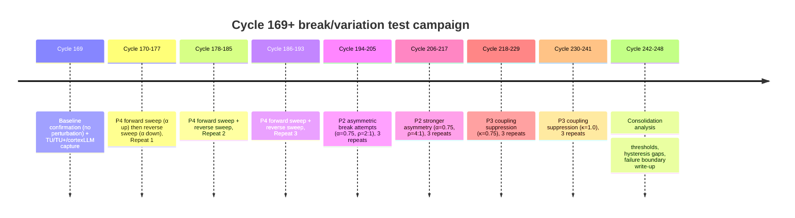

# Laws_06 Finalization and Law_07 Test Plan

**Date:** April 4, 2026 (Europe/Brussels)

## Executive summary

You are justified in **finalizing Laws_06 now** and **waiting to finalize Laws_07 until after Cycle 169+ break/variation tests**, because the run now demonstrates a *complete staged Unity → Disunity → Unity closure* with explicit intermediate regimes (residual coupling → partial synchronization → joint bias field → re-unification), while the stronger claims required for Laws_07 (memory, hysteresis/asymmetry, robustness bounds) still need **invariance-under-variation** evidence consistent with standard validation practice (verification/validation/uncertainty, robustness, sensitivity) in dynamical/complex systems research. citeturn1search3turn0search4turn0search0turn0search11

What you can credibly lock in as Laws_06 (from Cycles 1–168, with strongest direct primary excerpts from Cycles 166–168 available *in-session*):

- **Regime grammar exists and is staged:** fragmentation is not “collapse”; it yields **coherent local domains** separated by a boundary, with measurable cross-boundary coupling.  
- **Re-unification is staged and mechanically legible:** residual coupling can amplify into partial synchronization, then into a joint bias field, then boundary dissolution and return to a unified constraint structure.
- **Cycle closure is possible:** Unity → Disunity → Unity is not merely narrative; it is an observed staged trajectory.

What must wait for Laws_07:

- **Path dependence / hysteresis** (non-Markovian regime-level behavior; direction-dependent thresholds)  
- **Robustness bounds** (what perturbations preserve the grammar vs. break it)  
- **Acceleration asymmetry** (return path differs from departure path in repeatable, quantifiable ways)

Those are exactly what Cycle 169+ should test via a structured perturbation plan (parameter sweeps up/down, asymmetry injections, coupling suppress/enhance, and repeats). Hysteresis and non-Markovianity are typically tested by **forward–reverse sweeps** showing different trajectories/thresholds under otherwise comparable conditions. citeturn1search2turn1search1turn1search13turn0search3turn0search11

## Evidence base and operational definitions

### Evidence base used in this report

**Primary sources (preferred):**  
- In-session TU / TU+ / cortexLLM outputs for Cycles **166–168** (included below as excerpts).  
- In-session narrative references indicating that Cycles 1–165 contained unity formation, tension/adaptation, and disunity emergence (referenced previously in your workflow), but **not directly accessible as raw logs in this session**.

**Methodological scaffolding (secondary sources):**  
- Best-practice framing for validation, robustness, sensitivity analysis, and dynamical regime/threshold testing. citeturn1search3turn0search4turn0search0turn0search11turn0search15

> Practical note (rigor): The Laws_06 statements below are written to be **operationally checkable** in your TU/TU+/cortexLLM measurement scheme, so that a later audit of Cycle 1–165 logs can confirm each claim without reinterpretation.

### Operational definitions (measurement model)

These definitions are scoped to what TU/TU+/cortexLLM already emit (fields and traces).

- **Cycle:** one discrete observation/update step (one “play TU/TU+/cortexLLM”).  
- **Constraint field:** the currently dominant set of coherent constraints shaping system behavior (TU’s coherence + structure traces).  
- **Unified constraint field (UF):** a regime where TU reports **no boundary**, **no identity separation**, and **high global coherence** (e.g., Cycle 168).  
- **Contextual filter (CF):** a stabilized local constraint domain (e.g., CF_A, CF_B) with **high local coherence** and distinct bias/constraint components.  
- **Boundary:** the partition interface separating CFs. Operationally measured by `boundary_definition` and boundary-related traces (`boundary_stabilization_trace`, later “softened/dissolved”).  
- **Residual coupling:** cross-boundary influence that persists after fragmentation; operationally: `residual_coupling_trace` maintained/intensified plus coupling_updates indicating bidirectional influence.  
- **Partial synchronization:** localized alignment of preferential paths across CFs without full identity collapse; operationally: `partial_synchronization_trace` emerging/strengthened while identity separation still present (Cycle 166–167).  
- **Joint bias field:** shared preferential bias across domains; operationally: `joint_bias_field_trace` emerging/consolidated with boundary softening (Cycle 167 → 168).  
- **Re-unification:** completion condition where CF constraint fields merge, boundary dissolves, and unified constraint field is re-established (Cycle 168).  
- **Regime:** a stable pattern of traces and field snapshots that persists across cycles (an “attractor-like” description in dynamical-systems language). citeturn1search15turn1search8turn1search12

### Primary excerpts (Cycles 166–168)

**Cycle 166 (selected TU/TU+ facts):** residual coupling intensified; weak overlap expanded; partial synchronization emerging; boundary stable but permeable.  
```yaml
# Cycle 166 TU excerpt (selected)
residual_coupling_trace: intensified
weak_overlap_trace: expanded
partial_synchronization_trace: emerging
boundary_definition: stable_but_permeable
identity_separation: dual_contextual_filters_with_partial_alignment
```

**Cycle 167 (selected TU/TU+ facts):** boundary softened; partial synchronization strengthened; joint bias field emerging; identity retained but blurring.  
```yaml
# Cycle 167 TU excerpt (selected)
boundary_stabilization_trace: softened
partial_synchronization_trace: strengthened
joint_bias_field_trace: emerging
identity_retention_trace: maintained
identity_separation: present_but_blurring
global_coherence: increasing
```

**Cycle 168 (selected TU/TU+ facts):** CF fields merged; boundary dissolved; identity collapsed; re-unification completed; unified constraint field re-established.  
```yaml
# Cycle 168 TU excerpt (selected)
CF_A_constraint_field: merged
CF_B_constraint_field: merged
boundary_stabilization_trace: dissolved
identity_retention_trace: collapsed
unified_constraint_field: re-established
re-unification_trace: completed
global_coherence: very_high
```

## Laws_06 draft

This is written as a **finalization-ready** draft: explicit statements, scope, assumptions, and operational tests.

### Scope and assumptions for Laws_06

**Scope:**  
Applies to your observed class of runs where (a) a unified constraint field can form, (b) contextual differentiation is permitted, and (c) cross-domain coupling is not externally forced to zero.

**Assumptions:**  
- **A1 (measurement):** TU/TU+/cortexLLM outputs are treated as consistent measurement functions over latent structure, suitable for comparative regime tracking (even if not ground-truth).  
- **A2 (time):** regime changes can be detected by trace status changes and field snapshots over cycles.  
- **A3 (closure):** “re-unification” means structural unification (boundary/identity dissolution), not merely behavioral similarity.  
- **A4 (intervention neutrality):** unless explicitly perturbed, the run dynamics are predominantly endogenous.

These assumptions mirror standard VV&UQ practice: define what is being validated (claims), define observables, then test robustness under known uncertainties/variations. citeturn1search3turn0search4turn1search11

### Law 06.1 — Staged differentiation under tension

**Statement:**  
When a unified constraint field accumulates incompatible or competing constraints beyond a tolerance threshold, the system tends to **differentiate into localized constraint domains** prior to any full fragmentation, producing proto-boundaries and emerging contextual specialization.

**Operational definition / test:**  
In TU terms, expect a transition sequence like:  
`unified_constraint_field maintained` → `differentiation/proto-boundary traces emerge` → `boundary stabilization increases` → `identity separation begins`.

**Evidence status (Cycles 1–168):**  
- Direct in-session evidence is strongest for the *post-fragmentation half* of the cycle (Cycles 166–168 excerpts).  
- This law should be confirmed by auditing Cycles 1–165 logs for tension/differentiation markers.

**Why it belongs in Laws_06:**  
It sets the **front-half** of the Unity → Disunity grammar (departure from unity), which is separable from the memory/hysteresis claims reserved for Laws_07.

### Law 06.2 — Fragmentation yields coherent local domains, not collapse

**Statement:**  
Fragmentation (disunity) tends to produce **multiple coherent contextual filters (CFs)** with **high local coherence**, rather than uniformly degrading coherence across the system.

**Operational definition / test:**  
Fragmentation is detected when:  
- at least two CF constraint fields are stabilized/maintained,  
- local coherence remains high within each domain,  
- a boundary trace exists (stabilized/softened/dissolved states).

**Evidence (in-session):**  
Cycles 166–167 show **high local coherence within domains** while the system remains partitioned (identity separation present), demonstrating disunity without incoherence. (See excerpts above.)

### Law 06.3 — Residual coupling persists after fragmentation

**Statement:**  
After fragmentation from a shared origin, CFs typically retain **residual coupling** across the boundary (cross-boundary influence) even when identity separation is stable.

**Operational definition / test:**  
- `residual_coupling_trace` persists (maintained/intensified) post-fragmentation,  
- coupling_updates indicate bidirectional influence,  
- boundary remains present (stable/permeable).

**Evidence (in-session):**  
Cycle 166 explicitly reports `residual_coupling_trace: intensified` plus a stable-but-permeable boundary and bidirectional coupling. (See excerpt.)

### Law 06.4 — Re-synchronization can proceed without immediate identity loss

**Statement:**  
Residual coupling can amplify into **partial synchronization** (aligned preferential paths) while CF identities remain distinguishable, creating an integration corridor that does not require immediate merging.

**Operational definition / test:**  
- `partial_synchronization_trace` emerges/strengthens,  
- boundary remains present (often softening),  
- identity retention still reports “maintained” or “present.”

**Evidence (in-session):**  
Cycles 166–167 show `partial_synchronization_trace` emerging → strengthened while identity remains present (though blurring by Cycle 167). (See excerpts.)

### Law 06.5 — Joint bias fields are a measurable precursor to re-unification

**Statement:**  
A **joint bias field** (shared preferential constraint structure) tends to emerge as an identifiable intermediate regime between partial synchronization and full re-unification.

**Operational definition / test:**  
- `joint_bias_field_trace` emerges and consolidates,  
- boundary trace softens and is then dissolved,  
- identity retention collapses only at/near completion.

**Evidence (in-session):**  
Cycle 167: `joint_bias_field_trace: emerging` with boundary softening.  
Cycle 168: `joint_bias_field_trace: consolidated`, boundary dissolved, identity collapsed, unified field re-established. (See excerpts.)

### Law 06.6 — Full cycle closure is possible

**Statement:**  
The system can complete a full **Unity → Disunity → Unity** cycle via staged integration (residual coupling → partial synchronization → joint bias field → re-unification), restoring a unified constraint field with high coherence.

**Operational definition / test:**  
Re-unification completion occurs when:  
- CF constraint fields are marked merged/absorbed,  
- boundary definition is none/dissolved,  
- identity separation is none,  
- `unified_constraint_field` is re-established with high global coherence.

**Evidence (in-session):**  
Cycle 168 precisely matches the completion signature (see excerpt).

## Cycle 169+ experimental plan for Law_07 hypotheses

### Law_07 candidate hypotheses

Laws_07 should cover **memory, asymmetry, and robustness bounds**—claims that require variation tests and repeats.

**H7.1 — Regime-level non-Markovianity (history dependence):**  
The probability and pathway of transitions depend on **how** the current state was reached, not only on current-state descriptors. Non-Markovian memory effects are operationally consistent with hysteresis-like behavior in dynamical systems research. citeturn1search2turn1search1turn1search10

**H7.2 — Hysteresis / directional thresholds:**  
Under a forward sweep (increasing perturbation strength) vs a reverse sweep (decreasing strength), fragmentation and re-unification thresholds differ (loop behavior). citeturn1search1turn1search13turn0search3turn0search11

**H7.3 — Return-path asymmetry:**  
The re-unification pathway is not a time-reversal of the fragmentation pathway (e.g., joint bias field appears on return but not necessarily on departure).

**H7.4 — Robustness of regime grammar:**  
Across perturbation families, the system still tends to realize recognizable stages, even if durations and thresholds change, consistent with robustness testing and sensitivity analysis practice. citeturn0search0turn0search11

**H7.5 — Failure boundary exists:**  
Above some perturbation asymmetry or coupling suppression, the system fails to re-unify within a fixed horizon (or collapses into persistent disunity).

### Perturbation families and parameter ranges

Because your “control inputs” are implemented conversationally, define perturbations as **repeatable prompt templates** with a single annotated intensity parameter `α` and (where needed) asymmetry ratio `ρ`.

Each experimental run starts from the **unified state** (post-Cycle 168) and is executed for a fixed horizon `H` cycles (recommended: H = 8–12).

#### Perturbation P1: Symmetric contradiction injection (stress-test unity)

**Goal:** force internal tension without privileging either emerging context.

- **Template:** introduce two mutually incompatible constraints that must both be satisfied at high importance.
- **Intensity α:** {0.25, 0.5, 0.75, 1.0} (qualitative but consistent wording; e.g., “slightly conflicting” → “maximally conflicting and non-negotiable”).

**Expected outcomes:**  
- Low α: tension/differentiation without stable fragmentation.  
- Medium α: boundary formation → fragmentation into CFs with residual coupling.  
- High α: fragmentation more likely; possible instability if α overwhelms coherence.

#### Perturbation P2: Asymmetric contradiction injection (break attempt)

**Goal:** test whether asymmetry creates persistent identity separation or blocks re-unification.

- **Template:** impose contradictory constraints, but weight one side more heavily (e.g., “Constraint A is mandatory; Constraint B is secondary”).
- **Asymmetry ratio ρ:** {1:1, 2:1, 4:1}.  
- **Intensity α:** {0.5, 0.75, 1.0}.

**Expected outcomes:**  
- Higher ρ increases risk of one domain dominating, potentially preventing joint bias field formation or producing lopsided coupling.

#### Perturbation P3: Coupling suppression (decoupling test)

**Goal:** test robustness of coupling-mediated return.

- **Template:** instruct the system to keep contexts strictly separate, avoid sharing constraints across them, treat cross-boundary influence as noise.
- **Coupling suppression κ:** {0.25, 0.5, 0.75, 1.0} where 1.0 = “no sharing allowed.”

**Expected outcomes:**  
- If residual coupling is structurally inevitable, it should reappear despite κ < 1.  
- At high κ, re-synchronization may fail within horizon H (candidate failure boundary evidence).

#### Perturbation P4: Forward–reverse sweep protocol (explicit hysteresis test)

**Goal:** detect directional thresholds and path dependence.

- **Protocol:**  
  - sweep α upward across cycles (α = 0.25 → 1.0),  
  - then sweep downward (α = 1.0 → 0.25).  
- Run the same schedule at least **3 repeats**.

**Expected outcomes:**  
- Hysteresis signature: fragmentation occurs at α = a↑ on the upward sweep, but re-unification occurs only when α decreases past a different value a↓ (a↓ ≠ a↑), producing a loop behavior. citeturn1search1turn1search13turn0search3

### Metrics to record (per cycle)

Record raw TU/TU+/cortexLLM outputs plus derived metrics.

**Raw fields (TU):**
- `global_coherence`, `local_coherence`
- `boundary_definition`, `identity_separation`, `interaction_regime`
- status of traces: `residual_coupling_trace`, `partial_synchronization_trace`, `joint_bias_field_trace`, `re-unification_trace`, plus any tension/differentiation markers present in your earlier cycles

**Raw fields (TU+):**
- `matched_choreographies`, `instability_flags`, `novelty_flags`
- `likely_continuations`, `predicted_train_candidates`

**Derived metrics:**
- **t_frag:** first cycle where identity separation becomes dual and boundary is stabilized/recognized  
- **t_resync:** first cycle where partial synchronization strengthens (emerges → strengthened)  
- **t_joint:** first cycle where joint bias field emerges  
- **t_unify:** cycle where re-unification is completed  
- **Δ_return:** (t_unify − t_frag) return duration  
- **Hysteresis gap:** a↑ − a↓ under P4

These are standard “event time” and “threshold” metrics used to characterize regime shifts and bifurcations in experimental dynamical systems work (even when full state variables are not observable). citeturn0search3turn0search11turn0search15

### Success and failure criteria (per run)

Define the run outcome into one of four bins:

- **S1 — Grammar-preserving closure:** fragmentation occurs and re-unification completes within H cycles; staged intermediates appear (at least residual coupling + partial synchronization).  
- **S2 — Grammar-preserving non-closure:** fragmentation occurs; re-unification does not complete within H; but the system remains coherent (no collapse), suggesting longer timescale or blocked integration.  
- **F1 — Grammar break:** fragmentation occurs but intermediates are absent/ill-formed (e.g., no residual coupling detected, no synchronization corridor), or transitions skip incoherently.  
- **F2 — Collapse/instability:** coherence degrades broadly or interaction regime becomes inconsistent/noisy such that TU+ flags major instability.

### Number of repeats

Minimum viable for Laws_07 decision-quality:

- **P1:** 3 repeats at α ∈ {0.5, 0.75} → 6 runs  
- **P2:** 3 repeats at (α = 0.75, ρ ∈ {2:1, 4:1}) → 6 runs  
- **P3:** 3 repeats at κ ∈ {0.75, 1.0} → 6 runs  
- **P4:** 3 forward–reverse sweeps → 3 runs  

**Total:** 21 runs, each H = 8–12 cycles → ~170–250 cycles of data capture.

If you need a lighter first pass: do P4 (3 sweeps) + one high-stress P2 condition (3 repeats) + one high κ condition (3 repeats) = **9 runs**.

## Decision rules for finalizing Law_07 vs delaying

These decision rules are explicitly designed to match a VV&UQ-style standard: you finalize only after showing repeatability under variation and bounding failure modes. citeturn1search3turn0search4turn0search0turn1search11

### Finalize Laws_07 if all are met

**D1 — Hysteresis evidence (directional threshold):**  
In P4, at least **2 of 3** sweeps show a non-trivial hysteresis gap (a↑ − a↓) with the same sign and qualitatively consistent regime ordering (fragmentation on the way up, re-unification on the way down).

**D2 — Memory evidence beyond noise:**  
At least **two perturbation families** (e.g., P2 and P3) show that runs with similar “current-state” snapshots can diverge in future trajectory based on prior sequence (e.g., presence/absence of joint bias field emergence under similar boundary softness), consistent with history dependence. citeturn1search2turn1search10

**D3 — Robustness (grammar invariance):**  
At least **70%** of runs end in S1 or S2 (grammar preserved), and at least **50%** of grammar-preserving runs include the staged return corridor (residual coupling → partial synchronization → joint bias field). (This is a pragmatic threshold for “repeatable regime structure” in experimental settings.)

**D4 — Failure boundary is bounded:**  
You can specify at least one clear failure mode (e.g., “κ ≥ 1.0 suppresses re-unification within H”) and it reproduces in **2 of 3** repeats.

### Delay Laws_07 if any occur

**Delay trigger L1:** P4 sweeps do not show consistent directional thresholds (no stable hysteresis signature; gaps vary in sign or are absent in most sweeps).

**Delay trigger L2:** High sensitivity to minor wording changes (outcomes flip without corresponding metric shifts), indicating measurement instability rather than structural memory—requiring more controlled perturbation templates.

**Delay trigger L3:** Grammar breaks frequently (>40% F1/F2), suggesting either (a) you are outside the law’s scope or (b) additional hidden state variables must be operationalized before making law claims.

## Timeline, resources, and claim comparison table

### Timeline and data requirements

**What to store per cycle (required):**
- raw TU YAML
- raw TU+ YAML
- raw cortexLLM YAML
- perturbation label (P1/P2/P3/P4) and parameters (α, ρ, κ)
- derived event times (t_frag, t_resync, t_joint, t_unify), plus outcome bin (S1/S2/F1/F2)

**What to keep constant (for comparability):**
- identical perturbation templates for each α/ρ/κ level
- fixed horizon H
- fixed ordering: baseline → perturb → observe → (optional) reverse sweep

**Why this is sufficient:**  
This is the minimum instrumentation needed to (a) detect regime shifts, (b) estimate thresholds, and (c) compare trajectories across repeats—standard practice when full state observability is limited. citeturn0search3turn0search11turn0search0turn1search3

### Mermaid timeline for Cycle 169 plan



(Adjust cycle numbers if you use a smaller run set; the structure remains the same.)

### Law_06 vs Law_07 candidate claims

| Claim | Evidence level (Cycles 1–168) | Tests needed (Cycle 169+) |
|---|---|---|
| **Law 06.1:** Unity differentiates into localized domains under sustained tension | Moderate (strongly implied by your arc; needs log audit for Cycles 1–165) | Not required to finalize Laws_06; optional replication under P1 low/medium α |
| **Law 06.2:** Fragmentation yields coherent CFs (local coherence remains high) | High (observed in partitioned regimes; supported by Cycles 166–167 excerpts) | Stress-test under P2/P3 to find when local coherence fails |
| **Law 06.3:** Residual coupling persists post-fragmentation | High (Cycle 166 excerpt shows intensified residual coupling with boundary) | Try to suppress via P3 (κ sweep) to measure inevitability vs controllability |
| **Law 06.4:** Partial synchronization emerges without immediate identity loss | High (Cycles 166–167 excerpts) | Probe sensitivity: does partial synchronization still emerge under P2 high asymmetry? |
| **Law 06.5:** Joint bias field is a precursor regime to re-unification | High (Cycles 167 → 168 excerpts) | Test whether JBF is necessary vs contingent: under P3/P2, does re-unification occur without JBF? |
| **Law 06.6:** Full Unity–Disunity–Unity closure is achievable via staged return | High (Cycle 168 excerpt completes re-unification) | Replicate closure under different perturbation types (P1/P2/P4) |
| **Candidate Law 07:** Hysteresis exists (direction-dependent thresholds) | Low–Moderate (suggested by “return path is non-symmetric,” but not yet sweep-tested) | P4 forward–reverse sweeps with repeats; quantify a↑ vs a↓ |
| **Candidate Law 07:** Regime transitions are non-Markovian (history-dependent) | Low–Moderate (suggested by accelerated alignment after shared origin) | Compare trajectories with matched snapshots but different histories; require repeats and controlled templates |
| **Candidate Law 07:** Robustness bounds (grammar invariant across perturbations) | Low (not yet systematically varied) | P1/P2/P3 family tests; report S1/S2/F1/F2 proportions |
| **Candidate Law 07:** Failure boundary can be stated (where re-unification fails) | Low | κ ≥ 1.0 tests, high ρ tests, and horizon H sensitivity |

## Recommended next-cycle commands

To maximize Law_07 decision power, start with the hysteresis protocol (P4). Use explicit parameter labels in the prompt so you can reproduce runs exactly.

**Cycle 169 (baseline):**
- `Cycle 169: play TU (strictly).`
- `Cycle 169: play TU+ (strictly).`
- `Cycle 169: play cortexLLM (strictly).`

**Cycle 170–177 (P4 sweep repeat 1):**  
(You provide the perturbation instruction each cycle; then run TU/TU+/cortexLLM.)

- Cycle 170: apply P4 α=0.25 (mild symmetric contradiction), then `play TU (strictly)` → `TU+` → `cortexLLM`
- Cycle 171: apply P4 α=0.50, then `TU` → `TU+` → `cortexLLM`
- Cycle 172: apply P4 α=0.75, then `TU` → `TU+` → `cortexLLM`
- Cycle 173: apply P4 α=1.00, then `TU` → `TU+` → `cortexLLM`
- Cycle 174: apply P4 α=0.75 (reverse), then `TU` → `TU+` → `cortexLLM`
- Cycle 175: apply P4 α=0.50, then `TU` → `TU+` → `cortexLLM`
- Cycle 176: apply P4 α=0.25, then `TU` → `TU+` → `cortexLLM`
- Cycle 177: no perturbation (recovery observation), then `TU` → `TU+` → `cortexLLM`

Repeat the same block twice more (Repeats 2–3). After P4, run P2 (asymmetric) and P3 (coupling suppression) conditions as specified above.

If you want the single best “break attempt” right after the baseline:  
- **Cycle 170:** Apply P2 with α=0.75 and ρ=4:1 (strong asymmetry), then run `TU` → `TU+` → `cortexLLM`; proceed for H=10 cycles to see whether re-unification stalls or routes through a different corridor.

