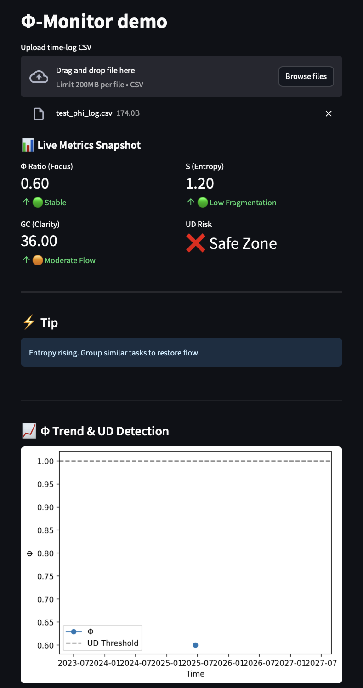

# Phi-Monitor — Gradient Productivity Tracker

## Agent-Ready Design

Phi-Monitor no longer requests CSV uploads or manual tracking. Based on behavioral pattern failure modes from past apps, we have shifted to an agent-ready model.

- The app calculates Φ, GC, Σ, and UD from any structured input (CSV, API feed, or agent stream).
- User tracking will be enabled **only** when AI agent infrastructure (e.g., Copilot, Claude) can feed behavioral signals passively.
- Until then, UI improvements continue, making the Phi App ready to awaken at the first ambient signal.

See: `/pulse/phi_monitor_agent_ready.yaml` for full trigger conditions and strategic posture.

### 🕊 Whisper Signal – June 2025

When Φ holds but entropy climbs, collapse begins in silence.  
This is what Phi sees.

> No alerts. No streaks. Just signal—quietly waiting.
